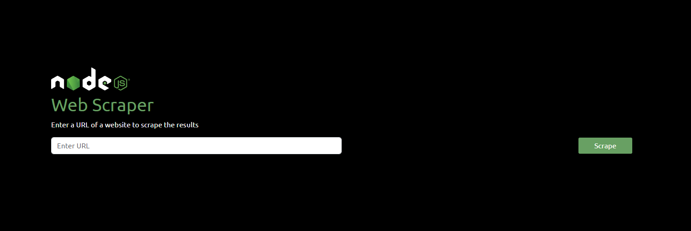

# Node Web Scraper With Puppeteer

The original project started as vanilla javascript, but I decided to use React to handle the state changes. The **_output_** route will make a GET request to the back-end `/api/v1/uploads/output.html` to get the scraped data. The back-end will then send the data to the front-end and the front-end will render the data in the browser.

You can view the markup by going to : `./client/src/uploads/output.html`

## Install Dependencies

`npm run build`

## Run Concurrently

`npm run dev`

# Simple Puppeteer Script to Scrape a Website

```javascript
const puppeteer = require("puppeteer");
const fs = require("fs");

async function run() {
  const browser = await puppeteer.launch();
  const page = await browser.newPage();

  await page.goto("https://marcovbarrantes.me");

  const bodyHTML = await page.evaluate(() => document.body.innerHTML);

  fs.writeFile("output.html", bodyHTML, function (err) {
    if (err) {
      return console.log(err);
    }

    console.log("The file was saved!");
  });

  await browser.close();
}

run();
```
